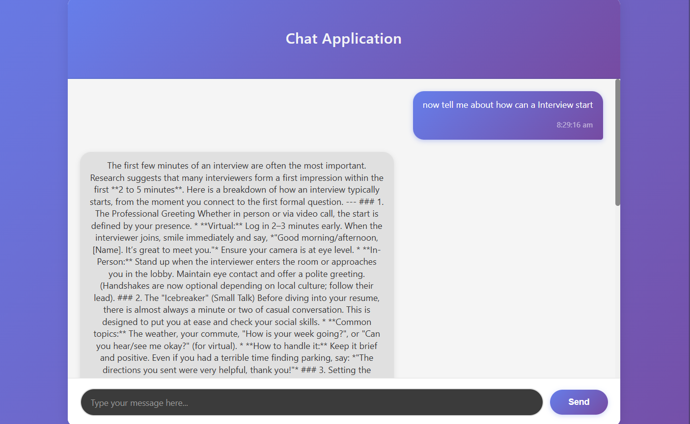

# 🚀 AI Chatbot Application (Real-Time)

A full-stack real-time AI chatbot application built using modern web technologies. This project integrates the **Gemini AI model** to generate intelligent and context-aware responses, providing a smooth conversational experience.

---

## 🧠 Tech Stack

### 🔹 Backend

* Node.js
* Express.js
* Socket.IO
* Gemini AI API

### 🔹 Frontend

* React.js
* Socket.IO Client
* CSS / Tailwind (optional)

---

## ⚡ Features

* 💬 Real-time chat using WebSockets (Socket.IO)
* 🤖 AI-powered responses using Gemini model
* ⚡ Instant message delivery (no page reloads)
* 🎯 Clean and responsive UI
* 🔄 Bi-directional communication (client ↔ server)
* 🧩 Scalable and modular architecture

---

## 📂 Project Structure

```
/client   → React frontend  
/server   → Node + Express backend  
```

---

## 🛠️ Installation & Setup

### 1️⃣ Clone the repository

```bash
git clone https://github.com/PuneetVerma07/Chat-Bot
cd Chat-Bot
```

### 2️⃣ Setup Backend

```bash
cd server
npm install
```

Create a `.env` file and add:

```
GEMINI_API_KEY=your_api_key_here
```

Start backend:

```bash
npm start
```

---

### 3️⃣ Setup Frontend

```bash
cd client
npm install
npm run dev
```

---

## 🔌 How It Works

1. User sends a message from React frontend
2. Message is sent to backend via Socket.IO
3. Backend processes request using Gemini AI
4. AI generates response
5. Response is sent back in real-time to frontend

---

## 📸 Demo

* screenshots *



---

## 🚀 Future Improvements

* Chat history storage (MongoDB)
* Authentication (JWT)
* Typing indicators
* Multi-user chat rooms
* Voice-based interaction

---

## 🤝 Contributing

Contributions are welcome! Feel free to fork this repo and submit a PR.

---

## 📜 License

This project is licensed under the MIT License.

---

## 👨‍💻 Author

**Puneet Verma**

* GitHub: https://github.com/PuneetVerma07
* LinkedIn: https://www.linkedin.com/in/puneetdotio

---
